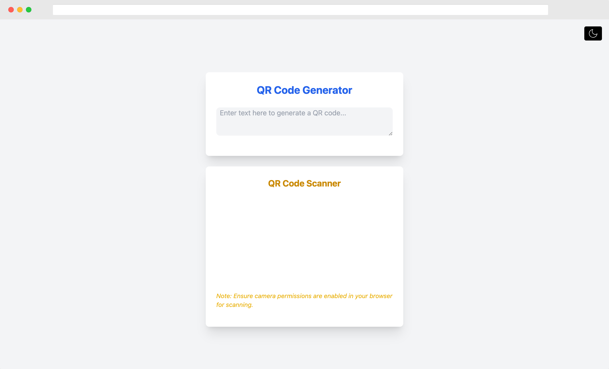

# qr-share

[](https://github.com/aarontorres0/qr-share/actions/workflows/deploy.yml)

[qr-share](https://aarontorres0.github.io/qr-share/) allows users to to generate and scan QR codes for seamless text transfer between devices.

<div align="center">
  
</div>

## Getting Started

Follow these steps to get a development environment up and running:

1. Clone this repository:

   ```
   git clone https://github.com/aarontorres0/qr-share.git
   ```

1. Navigate to the project directory:
   ```
   cd qr-share
   ```
1. Install dependencies:

   ```
   npm install
   ```

1. Run the development server:

   ```
   npm run dev
   ```

## Technologies Used

- **Frontend:** React.js with Vite
- **Styling:** Tailwind CSS and DaisyUI
- **qr-scanner**: library for QR code scanning using device camera
- **react-qr-code**: library for generating QR codes
